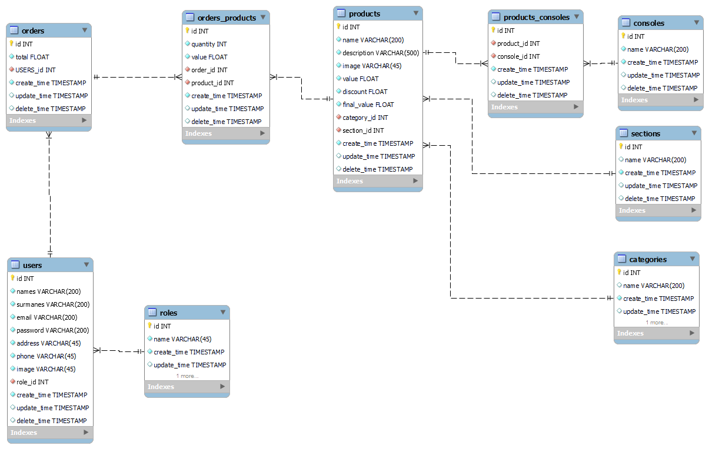

# ***POS GUS***

## Sitio web para sistema POS

### objetivo:

Sistema POS

### Integrantes : 

#### ___Gustavo Avella:___

Ingeniero en electronica , amante de la tecnologia y los proyectos de innovacion , entusiasta de las nuevas tendencias tecnologicas.

### Para clonar el repositorio usar:

`git clone https://github.com/gusavella/grupo_6_Games_Hub.git `

### Para actualizar el repositorio local usar:

`git pull https://github.com/gusavella/grupo_6_Games_Hub.git `

### Para actualizar el repositorio remoto usar:

`git push https://github.com/gusavella/grupo_6_Games_Hub.git `

## Ejecucion
Se descarga el repositorio bien sea clonado o descarga directa

### Creacion de base de datos 
Dentro de los archivos de repositorio existe la carpeta database_files
Dentro de esta carpeta se encuentran los archivos ***creacion DB 3.0.sql*** y ***INSERTA DATOS EN BD 3.0.sql***.
Ejecutar en workbench o cualquier manejador de base de datos (dveaver,consola, etc...) el archivo ***creacion DB 3.0.sql*** este crea el esquema de base de datos.
Enseguida ejecutar ***INSERTA DATOS EN BD 3.0.sql***, este crea datos iniciales en la base de datos.

### Ejecucion de proyecto de Node

Luego por consola de Visual sudio code (o terminal) ejecutar `npm install` para descargar todas las dependencias del proyecto.
En seguida se ejecuta en modo desarrollo por medio del comando `nodemon run dev`

### Ejecucion de dashboard de ***React***

Por consola de Visual sudio code ejecutar `cd Dashboard_react` para ir a la carpeta especificada.
Luego por consola de Visual sudio code (o terminal) ejecutar `npm install` para descargar todas las dependencias del proyecto.
Ya con las dependencias instaladas ejecutar el comando `npm start`

## Modelo Base de datos:

